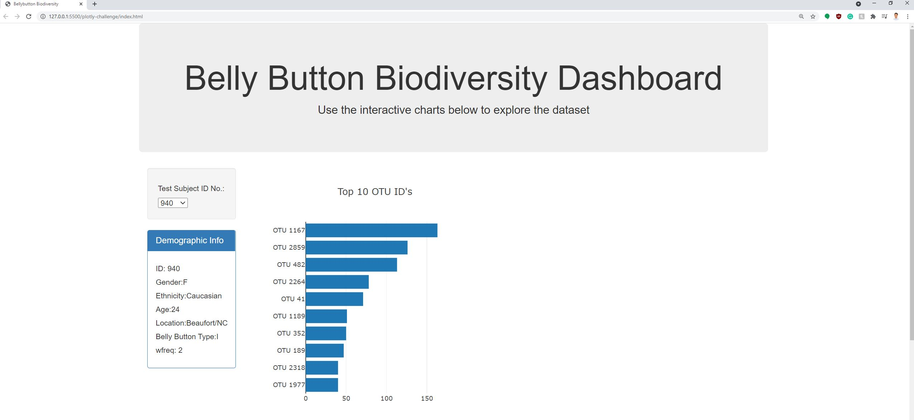
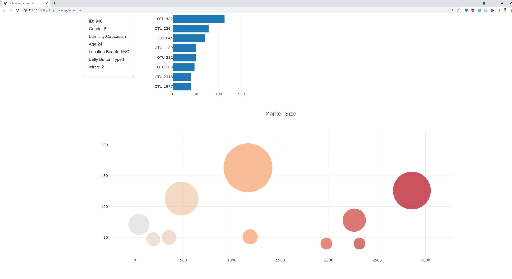

# plotly-challenge
This challenge uses D3 library to read in [samples data](samples.json). 
The javascript app then takes in user input based on the list of dropdown menu to match the test subject ID and displays the demographic info and displays top 10 OTU ID's in descending order. The bar graph is accompanied with a bubble chart for the corresponding data that charts out belly button size.

